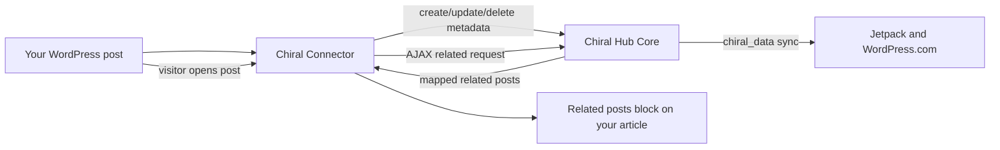

# Chiral Connector

[中文文档](./README.zh-CN.md)

[](./readme.txt)
[](https://wordpress.org/)
[](https://www.php.net/)
[](https://www.gnu.org/licenses/gpl-3.0.html)

Connect a WordPress site to a Chiral Hub so its posts can participate in federated cross-site related recommendations.

Chiral Connector is the WordPress node/client plugin for the WP Chiral Network. It syncs selected post metadata to a Chiral Hub, receives Jetpack/WordPress.com-powered related-post recommendations from that Hub, and renders those recommendations on your own post pages.

The official project site describes the goal clearly: let independent blogs build routes between each other without becoming another centralized content platform. See [WP Chiral Network](https://ckc.akashio.com/) and the [Connector plugin page](https://ckc.akashio.com/language/en/chiral-connector-plugin/).

## How It Fits



## Features

| Area | Capability |
| --- | --- |
| Hub connection | Connects to a Chiral Hub with Hub URL, Porter username, and WordPress Application Password. |
| Automatic sync | Syncs public post create/update/delete events to the Hub. |
| Per-post control | Provides a "Send to Chiral?" control so individual posts can opt in or out. |
| Related display | Appends related posts automatically or renders them with `[chiral_related_posts]`. |
| Cache | Caches related-post responses to reduce repeat network calls. |
| Batch sync | Provides a one-click path to sync existing posts after joining a network. |
| Failure handling | Retries failed sync work and exposes admin tools for connection testing and cache clearing. |
| Hub mode | Detects when it is installed on the same site as Chiral Hub Core and avoids cyclic synchronization. |
| Quit network | Requests deletion of node data on the Hub, clears local settings, and deactivates the plugin. |

## Requirements

- WordPress 5.2 or later.
- PHP 7.2 or later.
- A Chiral Hub running [Chiral Hub Core](https://github.com/Pls-1q43/Chiral-Hub-Core).
- A `chiral_porter` user on that Hub.
- A WordPress Application Password generated for the Porter user.

Your node site does not need Jetpack. Jetpack is required on the Hub because the Hub performs the WordPress.com related-post indexing workflow.

## Quick Start

1. Ask the Hub administrator for:
   - Hub URL, for example `https://hub.example.com`.
   - Porter username.
   - Application Password for that Porter user.
2. Install and activate Chiral Connector on your WordPress site.
3. Open the Chiral Connector settings page.
4. Fill in the Hub URL, Hub username, and Application Password.
5. Save settings and use **Test Connection**. A successful ping confirms the Hub credentials and REST API are reachable.
6. Configure display options, including related-post count and whether related posts should be appended automatically.
7. Run **Batch Sync All Posts** if the site already has existing posts that should join the network.

## Display Options

Automatic display appends a related-post container to single post content when related posts are enabled.

Manual placement is available with the shortcode:

```text
[chiral_related_posts count="3"]
```

The front-end script fills the container asynchronously. The default loading text is:

```html
<div id="chiral-connector-related-posts">Loading related Chiral data...</div>
```

## Hub Credentials

The Application Password must be generated on the Hub account that represents your node. It is not the normal login password. If the Hub administrator allows Porter users to log in, generate it from the WordPress profile page on the Hub. Otherwise, ask the Hub administrator to create it for you.

The display name of the Porter user may be used as the source name shown in related-post cards on other sites.

## Data and Privacy Model

- Chiral Connector only syncs selected post metadata and content needed by the Hub for indexing and recommendations.
- Your original posts remain on your own WordPress site.
- The Hub can moderate whether synchronized data participates in the Chiral Network, but it cannot edit your original posts.
- You can disable sync per post with the "Send to Chiral?" control.
- Quitting the network asks the Hub to delete your node data, clears local settings, and deactivates the plugin. After quitting, log in to the Hub or contact the Hub administrator to verify removal.

## LiteSpeed Cache Note

If the related-post block fails to load on a site using LiteSpeed Cache, configure an ESI exception for the nonce used by this plugin:

```text
chiral_connector_related_posts_nonce
```

In LiteSpeed Cache, enable ESI and add that nonce handle to the ESI Nonces list.

## Troubleshooting

| Symptom | Check |
| --- | --- |
| Test Connection fails | Confirm Hub URL includes `http://` or `https://`, credentials are exact, and the Hub REST API is reachable. |
| Posts do not sync | Confirm the connection test passes, the post is public, and "Send to Chiral?" is enabled. Run batch sync for historical posts. |
| Related posts do not display | Confirm related display is enabled, content has synced to the Hub, and Jetpack/WordPress.com has had time to index the Hub data. |
| Shortcode shows nothing | Confirm the post is participating in the network and the shortcode is on a single post/page where scripts are enqueued. |
| LiteSpeed sites show stale or broken related posts | Add the ESI nonce exception described above. |
| Quit network did not remove everything | Confirm directly on the Hub after the local plugin deactivates. |

## Releases and Updates

The current plugin version is `1.2.1`.

This repository is the release source for the plugin update checker bundled in the plugin. The update checker points to the `main` branch of `https://github.com/Pls-1q43/Chiral-Connector`.

## Links

- [WP Chiral Network](https://ckc.akashio.com/)
- [Chiral Connector plugin page](https://ckc.akashio.com/language/en/chiral-connector-plugin/)
- [How WP Chiral Network works](https://ckc.akashio.com/how-does-it-work/)
- [Chiral Hub Core](https://github.com/Pls-1q43/Chiral-Hub-Core)
- [Chiral Connector JS](https://github.com/Pls-1q43/Chiral-Connector-JS)
- [Author blog](https://1q43.blog/)

## License

GPL v3 or later. See the [GNU GPL v3 license](https://www.gnu.org/licenses/gpl-3.0.html).
