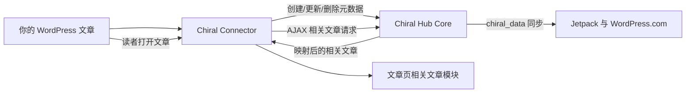

# Chiral Connector

[English](./README.md)

[](./readme.txt)
[](https://wordpress.org/)
[](https://www.php.net/)
[](https://www.gnu.org/licenses/gpl-3.0.html)

将一个 WordPress 站点连接到 Chiral Hub，让它的文章参与联邦制跨站相关文章推荐。

Chiral Connector 是 WP Chiral Network 的 WordPress 节点/客户端插件。它把选定文章的元数据同步到 Chiral Hub，从 Hub 获取由 Jetpack/WordPress.com 驱动的相关文章推荐，并把这些推荐展示在你自己站点的文章页上。

官网对目标的描述很明确：让独立博客之间重新建立内容路径，而不是再制造一个中心化内容平台。详见 [WP Chiral Network](https://ckc.akashio.com/) 和 [Connector 插件页面](https://ckc.akashio.com/language/en/chiral-connector-plugin/)。

## 生态位置



## 功能

| 模块 | 能力 |
| --- | --- |
| Hub 连接 | 使用 Hub URL、Porter 用户名和 WordPress 应用程序密码连接到 Chiral Hub。 |
| 自动同步 | 在公开文章创建、更新、删除时同步到 Hub。 |
| 单篇控制 | 提供 "Send to Chiral?" 控制项，让单篇文章可以选择是否参与同步。 |
| 相关文章展示 | 自动追加相关文章模块，或通过 `[chiral_related_posts]` 手动插入。 |
| 缓存 | 缓存相关文章响应，减少重复网络请求。 |
| 批量同步 | 加入网络后，可一键同步已有文章。 |
| 失败处理 | 对失败同步进行重试，并在后台提供连接测试和缓存清理工具。 |
| Hub 模式 | 检测自身是否安装在 Chiral Hub Core 同站点上，并避免循环同步。 |
| 退出网络 | 请求 Hub 删除节点数据，清除本地设置，并停用插件。 |

## 环境要求

- WordPress 5.2 或更高版本。
- PHP 7.2 或更高版本。
- 一个运行 [Chiral Hub Core](https://github.com/Pls-1q43/Chiral-Hub-Core) 的 Chiral Hub。
- Hub 上的 `chiral_porter` 用户。
- 为该 Porter 用户生成的 WordPress 应用程序密码。

节点站点本身不需要 Jetpack。Jetpack 需要安装在 Hub 上，因为 Hub 负责 WordPress.com 相关文章索引流程。

## 快速开始

1. 向 Hub 管理员获取：
   - Hub URL，例如 `https://hub.example.com`。
   - Porter 用户名。
   - 该 Porter 用户的应用程序密码。
2. 在你的 WordPress 站点安装并启用 Chiral Connector。
3. 打开 Chiral Connector 设置页。
4. 填写 Hub URL、Hub 用户名和应用程序密码。
5. 保存设置并点击 **Test Connection**。连接成功说明 Hub 凭据和 REST API 可用。
6. 配置展示选项，包括相关文章数量，以及是否自动追加相关文章模块。
7. 如果站点已有文章需要加入网络，运行 **Batch Sync All Posts**。

## 展示方式

启用自动展示后，插件会在单篇文章内容后追加一个相关文章容器。

如果需要手动控制位置，可以使用短码：

```text
[chiral_related_posts count="3"]
```

前端脚本会异步填充容器。默认加载文案为：

```html
<div id="chiral-connector-related-posts">Loading related Chiral data...</div>
```

## Hub 凭据

应用程序密码必须由 Hub 上代表你节点的账号生成。它不是普通登录密码。如果 Hub 管理员允许 Porter 用户登录后台，可以在 Hub 的 WordPress 个人资料页生成；否则需要请 Hub 管理员代为创建。

Porter 用户的显示名称可能会作为其他站点相关文章卡片中的来源名称。

## 数据与隐私模型

- Chiral Connector 只同步被选中文章的元数据，以及 Hub 索引和推荐所需的内容。
- 原始文章始终保留在你自己的 WordPress 站点。
- Hub 可以审核同步数据是否参与 Chiral Network，但不能编辑你的原始文章。
- 你可以用 "Send to Chiral?" 控制单篇文章是否同步。
- 退出网络会请求 Hub 删除你的节点数据、清除本地设置并停用插件。退出后应登录 Hub 或联系 Hub 管理员确认数据已删除。

## LiteSpeed Cache 注意事项

如果使用 LiteSpeed Cache 的站点无法正确加载相关文章模块，需要为本插件使用的 nonce 配置 ESI 例外：

```text
chiral_connector_related_posts_nonce
```

在 LiteSpeed Cache 中启用 ESI，并把该 nonce handle 加入 ESI Nonces 列表。

## 故障排查

| 现象 | 检查项 |
| --- | --- |
| Test Connection 失败 | 确认 Hub URL 包含 `http://` 或 `https://`，凭据完全正确，且 Hub REST API 可访问。 |
| 文章没有同步 | 确认连接测试通过、文章是公开状态，并且 "Send to Chiral?" 已启用。历史文章需要运行批量同步。 |
| 相关文章不展示 | 确认相关文章展示已启用、内容已同步到 Hub，并给 Jetpack/WordPress.com 留出索引时间。 |
| 短码没有输出 | 确认该文章已参与网络，并且短码所在页面会加载插件脚本。 |
| LiteSpeed 站点显示过期或异常 | 按上文添加 ESI nonce 例外。 |
| 退出网络后仍担心数据残留 | 本地插件停用后，应直接到 Hub 上确认。 |

## 发布与更新

当前插件版本为 `1.2.1`。

本仓库是插件内置更新检查器的发布源。更新检查器指向 `https://github.com/Pls-1q43/Chiral-Connector` 的 `main` 分支。

## 链接

- [WP Chiral Network](https://ckc.akashio.com/)
- [Chiral Connector 插件页面](https://ckc.akashio.com/language/en/chiral-connector-plugin/)
- [WP Chiral Network 工作原理](https://ckc.akashio.com/how-does-it-work/)
- [Chiral Hub Core](https://github.com/Pls-1q43/Chiral-Hub-Core)
- [Chiral Connector JS](https://github.com/Pls-1q43/Chiral-Connector-JS)
- [作者博客](https://1q43.blog/)

## 许可证

GPL v3 或更高版本。详见 [GNU GPL v3 license](https://www.gnu.org/licenses/gpl-3.0.html)。
